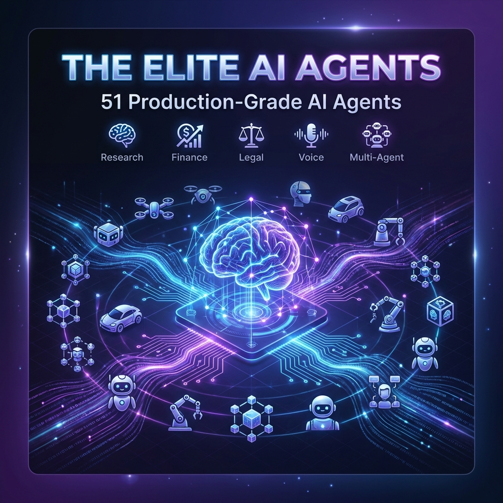

<div align="center">



# 🤖 The Elite AI Agents

### **The Most Comprehensive Collection of Production-Grade AI Agents**

[](https://www.python.org/)
[](LICENSE)
[]()
[](https://streamlit.io/)
[](https://langchain.com/)

[](https://openai.com/)
[](https://anthropic.com/)
[](https://deepmind.google/technologies/gemini/)
[](https://docker.com/)
[]()

---

**51 specialized agents** covering **Research** • **Finance** • **Legal** • **Health** • **Voice AI** • **Multi-Agent Teams** • **MCP Integrations** and more.

Each agent is **fully containerized**, **production-ready**, and built with **enterprise-grade architecture**.

[📖 Documentation](#-quick-start) • [🚀 Quick Start](#-quick-start) • [📦 Agent Directory](#-agent-directory) • [🤝 Contributing](CONTRIBUTING.md)

</div>

---

## ⚡ Highlights

<table>
<tr>
<td width="33%">

### 🎯 Production Ready
Every agent includes complete source code, tests, Docker configuration, and CI/CD pipelines. Ready to deploy immediately.

</td>
<td width="33%">

### 🧠 Multi-LLM Support
Agents work with OpenAI GPT-4, Anthropic Claude, and Google Gemini. Swap providers with a single config change.

</td>
<td width="33%">

### 🎨 Beautiful UIs
Each agent features a polished Streamlit interface with modern design, responsive layouts, and intuitive controls.

</td>
</tr>
</table>

---

## 📊 Agent Categories

| Category | Count | Agents |
|:---------|:-----:|:-------|
| 🚀 **Starter Agents** | 12 | Blog-to-Podcast, Data Analyst, Travel, Medical Imaging, Meme Generator, Music, Research, Web Scraper... |
| ⚡ **Advanced Agents** | 18 | Deep Research, Financial Coach, Legal Counsel, Health & Fitness, Investment Analyst, System Architect... |
| 🤝 **Multi-Agent Teams** | 12 | Finance Team, Game Design, Recruitment, Real Estate, Teaching, Competitor Intelligence, UI/UX Team... |
| 🎤 **Voice AI Agents** | 4 | Audio Tour Guide, Customer Support, Voice RAG, Dictation Assistant |
| 🔗 **MCP Agents** | 4 | Browser Automation, GitHub, Notion, Travel Planner |
| 💡 **Custom Agents** | 5 | Paper-to-Code, CV Model Deployer, Email Automation, Code Security, Knowledge Base |

---

## 📦 Agent Directory

<details>
<summary><b>🚀 Starter Agents (12)</b> - Click to expand</summary>

| Agent | Description | Primary LLM |
|-------|-------------|-------------|
| [ai-audio-tour](agents/ai-audio-tour) | Interactive audio tour guide with location-based narration | OpenAI |
| [ai-blog-to-podcast](agents/ai-blog-to-podcast) | Convert blog articles to podcast episodes with AI voices | OpenAI + ElevenLabs |
| [ai-breakup-recovery](agents/ai-breakup-recovery) | Compassionate emotional support using CBT techniques | Anthropic |
| [ai-data-analyst-pro](agents/ai-data-analyst-pro) | Automated data analysis with visualizations | OpenAI |
| [ai-medical-imaging](agents/ai-medical-imaging) | Medical image analysis and reporting | Google |
| [ai-meme-generator](agents/ai-meme-generator) | AI-powered meme creation tool | OpenAI + DALL-E |
| [ai-music-generator](agents/ai-music-generator) | AI music composition and generation | Google |
| [ai-travel-concierge](agents/ai-travel-concierge) | Personalized travel planning assistant | Google |
| [gemini-multimodal-agent](agents/gemini-multimodal-agent) | Multimodal AI with vision and language | Google Gemini |
| [mixture-of-agents](agents/mixture-of-agents) | Ensemble agent combining multiple LLMs | Multi-LLM |
| [openai-research-agent](agents/openai-research-agent) | Research assistant powered by GPT-4 | OpenAI |
| [web-scraper-agent](agents/web-scraper-agent) | Intelligent web scraping with anti-detection | Anthropic |
| [xai-finance-agent](agents/xai-finance-agent) | Financial analysis with explainable AI | OpenAI |

</details>

<details>
<summary><b>⚡ Advanced Agents (18)</b> - Click to expand</summary>

| Agent | Description | Primary LLM |
|-------|-------------|-------------|
| [ai-consultant](agents/ai-consultant) | Strategic business consulting with SWOT analysis | Anthropic |
| [ai-deep-research-agent](agents/ai-deep-research-agent) | Deep academic research with Arxiv/PubMed integration | OpenAI |
| [ai-financial-coach](agents/ai-financial-coach) | Financial planning and investment advisor | OpenAI |
| [ai-health-fitness](agents/ai-health-fitness) | Personalized health coaching and workout planning | Google |
| [ai-home-renovation](agents/ai-home-renovation) | Home renovation planning with cost estimation | Google |
| [ai-investment-analyst](agents/ai-investment-analyst) | Advanced investment analysis and portfolio optimization | OpenAI |
| [ai-journalist](agents/ai-journalist) | Automated journalism with fact-checking | OpenAI |
| [ai-knowledge-base](agents/ai-knowledge-base) | Personal second brain with semantic search | Anthropic |
| [ai-legal-counsel](agents/ai-legal-counsel) | Contract analysis and legal risk assessment | Anthropic |
| [ai-meeting-assistant](agents/ai-meeting-assistant) | Meeting transcription and action item extraction | OpenAI |
| [ai-mental-wellbeing](agents/ai-mental-wellbeing) | Mental health support with CBT techniques | Anthropic |
| [ai-movie-production](agents/ai-movie-production) | Movie production assistance and script analysis | Anthropic |
| [ai-product-launch](agents/ai-product-launch) | Product launch intelligence and GTM strategy | OpenAI |
| [ai-sales-intelligence](agents/ai-sales-intelligence) | Sales intelligence with lead scoring | OpenAI |
| [ai-system-architect](agents/ai-system-architect) | System architecture design and tech evaluation | OpenAI |
| [ai-vc-due-diligence-team](agents/ai-vc-due-diligence-team) | VC due diligence and startup evaluation | OpenAI |

</details>

<details>
<summary><b>🤝 Multi-Agent Teams (12)</b> - Click to expand</summary>

| Agent | Description | Primary LLM |
|-------|-------------|-------------|
| [ai-competitor-intelligence](agents/ai-competitor-intelligence) | Multi-agent competitive intelligence team | Anthropic |
| [ai-finance-team](agents/ai-finance-team) | Collaborative financial analysis team | OpenAI |
| [ai-game-design-team](agents/ai-game-design-team) | Game mechanics, narrative, and balance team | Anthropic |
| [ai-real-estate-team](agents/ai-real-estate-team) | Property valuation and market analysis | Google |
| [ai-recruitment-team](agents/ai-recruitment-team) | Resume screening and candidate matching | OpenAI |
| [ai-services-agency](agents/ai-services-agency) | Full-service AI agency with CrewAI | Anthropic |
| [ai-teaching-team](agents/ai-teaching-team) | Personalized learning and education | OpenAI |
| [ai-travel-planner-team](agents/ai-travel-planner-team) | Comprehensive multi-destination planning | OpenAI |
| [multimodal-coding-team](agents/multimodal-coding-team) | Visual code analysis and generation | OpenAI |
| [multimodal-design-team](agents/multimodal-design-team) | Design concept generation and critique | Google |
| [multimodal-uiux-team](agents/multimodal-uiux-team) | UI/UX analysis and recommendations | Anthropic |

</details>

<details>
<summary><b>🎤 Voice AI & 🔗 MCP Agents (8)</b> - Click to expand</summary>

**Voice AI Agents:**
| Agent | Description |
|-------|-------------|
| [customer-support-voice](agents/customer-support-voice) | Voice-based customer support |
| [voice-dictation](agents/voice-dictation) | Advanced voice dictation with formatting |
| [voice-rag-agent](agents/voice-rag-agent) | Voice-powered document retrieval |

**MCP Agents:**
| Agent | Description |
|-------|-------------|
| [browser-mcp-agent](agents/browser-mcp-agent) | Browser automation via MCP |
| [github-mcp-agent](agents/github-mcp-agent) | GitHub operations via MCP |
| [notion-mcp-agent](agents/notion-mcp-agent) | Notion workspace management via MCP |
| [travel-planner-mcp](agents/travel-planner-mcp) | Travel planning via MCP |

</details>

<details>
<summary><b>💡 Custom Agents (5)</b> - Click to expand</summary>

| Agent | Description | Primary LLM |
|-------|-------------|-------------|
| [ai-code-security](agents/ai-code-security) | Automated security code review | OpenAI |
| [ai-cv-model-deployer](agents/ai-cv-model-deployer) | One-click CV model deployment | OpenAI |
| [ai-email-automation](agents/ai-email-automation) | Intelligent email management | Anthropic |
| [ai-paper-to-code](agents/ai-paper-to-code) | Convert research papers to code | Anthropic |

</details>

---

## 🚀 Quick Start

### Run Any Agent in 60 Seconds

```bash
# Clone the repository
git clone https://github.com/KanavjeetS/The-Elite-AI-Agents.git
cd The-Elite-AI-Agents

# Pick an agent (e.g., ai-deep-research-agent)
cd agents/ai-deep-research-agent

# Set up environment
python -m venv venv
.\venv\Scripts\activate  # Windows
# source venv/bin/activate  # macOS/Linux

# Install dependencies
pip install -r requirements.txt

# Configure API keys
cp .env.example .env
# Edit .env with your API keys (OPENAI_API_KEY, etc.)

# Launch the agent! 🚀
streamlit run app.py
```

### Run with Docker 🐳

```bash
cd agents/ai-deep-research-agent

# Build
docker build -t ai-research-agent .

# Run
docker run -p 8501:8501 \
  -e OPENAI_API_KEY=your-key \
  ai-research-agent

# Open http://localhost:8501
```

---

## 🏗️ Architecture

Every agent follows a consistent, production-grade structure:

```
agents/[agent-name]/
├── 📁 src/
│   ├── agents/         # Core agent logic
│   ├── models/         # Pydantic config models
│   ├── tools/          # Custom LangChain tools
│   └── utils/          # Logging, exceptions
├── 📁 tests/
│   ├── unit/           # Unit tests
│   └── integration/    # Integration tests
├── 📁 docs/            # Agent documentation
├── 📄 app.py           # Streamlit UI
├── 📄 Dockerfile       # Container config
├── 📄 requirements.txt # Dependencies
├── 📄 .env.example     # Environment template
└── 📄 README.md        # Agent docs
```

### 🛠️ Technology Stack

<table>
<tr>
<td><b>LLM Providers</b></td>
<td>OpenAI GPT-4, Anthropic Claude 3, Google Gemini Pro</td>
</tr>
<tr>
<td><b>Frameworks</b></td>
<td>LangChain, Streamlit, FastAPI, Pydantic</td>
</tr>
<tr>
<td><b>Vector Databases</b></td>
<td>Qdrant, ChromaDB, Pinecone</td>
</tr>
<tr>
<td><b>Containerization</b></td>
<td>Docker, Docker Compose</td>
</tr>
<tr>
<td><b>CI/CD</b></td>
<td>GitHub Actions</td>
</tr>
<tr>
<td><b>Testing</b></td>
<td>Pytest, pytest-cov</td>
</tr>
</table>

---

## 📋 Requirements

- **Python 3.11+**
- **At least one LLM API key:**
  - OpenAI API Key, or
  - Anthropic API Key, or
  - Google Gemini API Key
- **Docker** (optional, for containerized deployment)

---

## 🤝 Contributing

Contributions are welcome! Please see [CONTRIBUTING.md](CONTRIBUTING.md) for guidelines.

### Adding a New Agent

1. Create a new directory in `agents/`
2. Follow the standard structure
3. Update this README
4. Submit a PR

---

## 📄 License

This project is licensed under the MIT License - see the [LICENSE](LICENSE) file for details.

---

## ⭐ Star History

If you find this useful, please consider giving it a star! ⭐

---

<div align="center">

### Built with ❤️ by [Kanavjeet Singh](https://github.com/KanavjeetS)

**51 Production-Grade AI Agents | Enterprise Architecture | Ready for Deployment**

[](https://github.com/KanavjeetS/The-Elite-AI-Agents)
[](https://github.com/KanavjeetS/The-Elite-AI-Agents)

</div>
